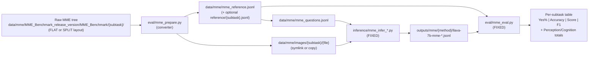
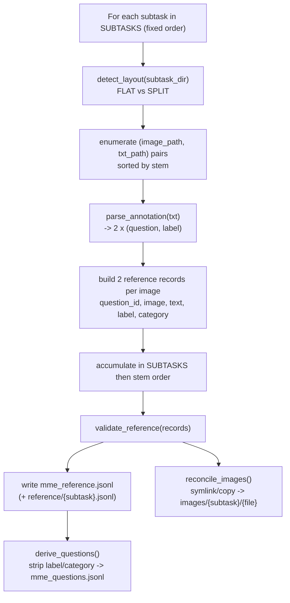

# Design Document: MME Results Table — Data Preparation

## Overview

The MME inference (`inference/mme_infer_*.py`) and evaluation (`eval/mme_eval.py`,
`eval/mme_constants.py`) pipeline is already built and is treated here as a
**fixed downstream consumer**. The only thing missing to reproduce the paper's
MME results table (Yes% | Accuracy | Score | F1 with Perception/Cognition
totals) is the data: the repo ships the raw MME release tree under
`data/mme/MME_Benchmark_release_version/MME_Benchmark/{subtask}/`, but none of
the JSONL/image files the pipeline expects exist yet.

This feature adds a **one-time data-preparation step** that converts the raw
two-line `.txt` MME annotations into the exact JSONL schema the evaluator
requires, reconciles the two on-disk image layouts into a single uniform image
view, and derives the combined inference-input file. It also updates
`README_MME.md` Section 4 ("Prepare the data") with the concrete commands to run
the converter end-to-end and reproduce the full table.

Scope is strictly the **converter + README**. The inference and eval modules are
not redesigned; the converter's output schema and invariants are dictated
entirely by what `eval/mme_eval.py` already consumes, so the downstream
invariants hold *by construction*.

### Goals

- Walk all 14 subtask folders, auto-detecting FLAT vs SPLIT layout per subtask.
- Parse each two-line `question<TAB>answer` `.txt` into reference records.
- Emit `data/mme/mme_reference.jsonl` (and optional per-subtask
  `data/mme/reference/{subtask}.jsonl`) in the evaluator's exact schema, with
  deterministic, stable, unique `question_id`s (two per image) and a correct
  `image` field (`{subtask}/{filename}` with the real extension).
- Materialize images at `data/mme/images/{subtask}/{filename}` so the `image`
  field resolves under `--image-folder ./data/mme/images`.
- Derive `data/mme/mme_questions.jsonl` from the reference (strip
  `label`/`category`).
- Validate its own output so the evaluator's invariants (two questions per
  image, labels in `{yes,no}`, unique & positionally aligned ids) are guaranteed.

### Non-Goals

- No change to inference scripts, the evaluator, the metrics, or the table
  renderer.
- No re-download or re-packaging of the MME benchmark itself.
- No new decoding methods or scoring logic.

---

## Placement & Conventions (decision + justification)

**Decision:** add the converter as `eval/mme_prepare.py` with a sibling
`eval/test_mme_prepare.py`.

Justification:

1. **Single source of truth for the subtask vocabulary.** The converter must
   know the 14 subtask names and the Perception/Cognition split. These live in
   `eval/mme_constants.py`, and `eval/` modules import them directly
   (`from mme_constants import PERCEPTION, COGNITION`). Co-locating the converter
   in `eval/` lets it reuse the same import with no path gymnastics.
2. **Tight coupling to the consumer.** The output schema is defined by
   `eval/mme_eval.py`. Producer and consumer belong together; `eval/mme_prepare.py`
   sits next to `eval/mme_eval.py` exactly as `eval/test_mme_eval.py` sits next
   to it.
3. **Repo convention.** The repo's pattern is *pure, testable helper functions*
   (e.g. `inference/mme_infer_common.py`) + a *thin script entry point* (e.g.
   `inference/mme_infer_base.py`'s `__main__`) + a *sibling `test_*.py` with
   Hypothesis tests* (e.g. `eval/test_mme_eval.py`). `eval/mme_prepare.py`
   follows this: pure parsing/record-building helpers, an `argparse` entry point,
   and `eval/test_mme_prepare.py`.

A thin convenience wrapper `scripts/mme_prepare.sh` is added to mirror the other
`scripts/mme_*.sh` wrappers and to give the README a single copy-paste command.

> All commands are run from the repository root (`cd_rethink/`), matching the
> existing scripts whose default paths are repo-root-relative.

---

# High-Level Design

## Architecture

The architecture is a single batch converter (`eval/mme_prepare.py`) that sits
between the committed raw MME release tree and the already-built inference/eval
pipeline. It is the only new component; everything downstream of it is fixed.
The data flow and converter-internal pipeline are shown below.

### Data Flow



The dashed boundary of responsibility: this feature owns `RAW → PREP → {REF, IMG, Q}`.
Everything from `INFER` onward already exists and is unchanged.

## Converter pipeline (high level)



## Image-layout reconciliation (decision + justification)

Two raw layouts exist and both must be handled:

- **FLAT** (e.g. `OCR`, `code_reasoning`): `{subtask}/{stem}.jpg|.png` and
  `{subtask}/{stem}.txt` are siblings.
- **SPLIT** (e.g. `artwork`, `celebrity`): `{subtask}/images/{stem}.jpg` and
  `{subtask}/questions_answers_YN/{stem}.txt`.

The evaluator/inference `image` field is `{subtask}/{filename}` resolved under
`--image-folder ./data/mme/images`. The SPLIT layout's `{subtask}/images/{file}`
does **not** match this, so a reconciliation step is required.

**Decision:** materialize a uniform view at `data/mme/images/{subtask}/{filename}`,
defaulting to **relative symlinks**, with a `--copy` flag to physically copy
instead.

Justification:

- **Symlink (default):** MME images total many hundreds of MB; symlinks avoid
  duplicating them and keep the committed raw tree as the single source of truth.
  Relative symlinks (computed against the raw tree's location) stay valid if the
  repo is moved as a whole.
- **`--copy` fallback:** some environments (certain Windows setups, archived
  tarballs, restrictive filesystems) don't support symlinks; `--copy` produces a
  fully self-contained `images/` tree.
- **Why not point `--image-folder` at the raw tree directly:** impossible — FLAT
  and SPLIT layouts are inconsistent with each other and neither uniformly
  matches `{subtask}/{file}`. Reconciliation into one view is mandatory.

The real file extension is preserved (`.jpg` vs `.png`) so the `image` field and
the on-disk file always agree.

---

# Low-Level Design

All code is Python 3 (matching the existing pipeline). Pure helpers carry no I/O
where practical so they can be Hypothesis-tested without a filesystem.

## Data Models

### Raw annotation file (`{stem}.txt`)

Exactly two non-empty lines, each `question<TAB>answer`, answer ∈ {`Yes`, `No`}
(case-insensitive). Example (`OCR/0001.txt`):

```text
Is the word in the logo "angie's"? Please answer yes or no.\tYes
Is the word in the logo "angle's"? Please answer yes or no.\tNo
```

### Reference record (line of `mme_reference.jsonl`) — consumed by `eval/mme_eval.py`

```python
ReferenceRecord = TypedDict("ReferenceRecord", {
    "question_id": str,   # deterministic, stable, globally unique
    "image": str,         # "{subtask}/{filename}" incl. real extension
    "text": str,          # the question text (verbatim, left of the TAB)
    "label": str,         # "yes" | "no" (normalized lower-case)
    "category": str,      # one of the 14 subtask names (== SUBTASKS member)
})
```

### Question record (line of `mme_questions.jsonl`) — consumed by `inference/mme_infer_*.py`

```python
QuestionRecord = TypedDict("QuestionRecord", {
    "question_id": str,   # identical to the reference at the same position
    "image": str,
    "text": str,
})
```

### `question_id` scheme

`question_id = f"{subtask}/{stem}_{line_index}"` where `line_index ∈ {0, 1}`.

Properties this guarantees:

- **Deterministic & stable:** depends only on inputs (subtask, file stem, line
  index), not on wall-clock, randomness, or iteration nondeterminism.
- **Globally unique:** subtask folders are distinct; stems are unique within a
  subtask; `line_index` distinguishes the two questions of one image.
- **Two distinct ids per image:** `_0` and `_1`.
- **Positional alignment for free:** `mme_questions.jsonl` is produced by
  projecting `mme_reference.jsonl` line-by-line in order, so the id at each index
  matches by construction (`validate_alignment` passes).

## Components and Interfaces

The converter is one module, `eval/mme_prepare.py`, composed of small pure
helpers plus a thin entry point. The components and their contracts:

| Component | Responsibility | Key interface |
|-----------|----------------|---------------|
| `parse_annotation` | Parse one `.txt` body into two `(question, label)` pairs | `(raw_text: str) -> list[tuple[str, str]]` |
| `make_question_id` | Deterministic, unique per-question id | `(subtask, stem, line_index) -> str` |
| `build_image_field` | Uniform `{subtask}/{filename}` image path | `(subtask, image_filename) -> str` |
| `build_records_for_image` | Two reference records for one image | `(subtask, image_filename, raw_text) -> list[ReferenceRecord]` |
| `detect_layout` | FLAT vs SPLIT auto-detection | `(subtask_dir) -> "flat" \| "split"` |
| `enumerate_pairs` | Sorted `(image, txt)` pairs for a subtask | `(subtask_dir, layout) -> list[tuple[str, str]]` |
| `convert_subtask` | All reference records for one subtask | `(raw_root, subtask) -> list[ReferenceRecord]` |
| `validate_reference` | Re-assert evaluator invariants pre-write | `(records) -> None (raises)` |
| `derive_questions` | Project reference → inference input | `(reference) -> list[QuestionRecord]` |
| `reconcile_images` | Materialize uniform `images/` view | `(raw_root, subtask, layout, out_images_root, copy) -> None` |
| `main` | argparse entry point, orchestration | `() -> None` |

Detailed signatures, pseudocode, and formal specs for each follow.

## Module Layout

```
eval/mme_prepare.py        # pure helpers + argparse entry point (new)
eval/test_mme_prepare.py   # pytest + hypothesis (new)
scripts/mme_prepare.sh     # thin wrapper (new)
```

## Core Constants

```python
from mme_constants import SUBTASKS, PERCEPTION, COGNITION  # 14 subtask names

# Per-subtask raw sub-paths for the SPLIT layout.
SPLIT_IMAGE_DIR = "images"
SPLIT_TEXT_DIR = "questions_answers_YN"

IMAGE_EXTENSIONS = (".jpg", ".jpeg", ".png")
VALID_LABELS = {"yes", "no"}
```

## Key Functions with Formal Specifications

### `parse_annotation(raw_text: str) -> list[tuple[str, str]]`

Parse one raw `.txt` body into exactly two `(question, label)` pairs.

- **Preconditions:** `raw_text` is the full file contents.
- **Postconditions:** returns a 2-element list; each `question` is the non-empty
  text left of the first TAB; each `label` ∈ {`"yes"`, `"no"`} (lower-cased).
- **Raises:** `ValueError` if there are not exactly two non-empty lines; if any
  line lacks a TAB; if a question is empty; or if an answer is not Yes/No
  (case-insensitive).

```python
def parse_annotation(raw_text: str) -> list[tuple[str, str]]:
    lines = [ln for ln in raw_text.splitlines() if ln.strip()]
    if len(lines) != 2:
        raise ValueError(f"expected exactly 2 non-empty lines, found {len(lines)}")
    pairs = []
    for ln in lines:
        if "\t" not in ln:
            raise ValueError(f"missing TAB separator in line: {ln!r}")
        question, _, answer = ln.partition("\t")
        question = question.strip()
        label = answer.strip().lower()
        if not question:
            raise ValueError(f"empty question in line: {ln!r}")
        if label not in VALID_LABELS:
            raise ValueError(f"label must be Yes/No, got: {answer.strip()!r}")
        pairs.append((question, label))
    return pairs
```

### `build_image_field(subtask: str, image_filename: str) -> str`

```python
def build_image_field(subtask: str, image_filename: str) -> str:
    # Always "{subtask}/{filename}" with the real extension preserved.
    return f"{subtask}/{image_filename}"
```

### `make_question_id(subtask: str, stem: str, line_index: int) -> str`

```python
def make_question_id(subtask: str, stem: str, line_index: int) -> str:
    return f"{subtask}/{stem}_{line_index}"
```

### `build_records_for_image(subtask, image_filename, raw_text) -> list[ReferenceRecord]`

Combine the helpers into the two reference records for one image.

- **Postconditions:** returns exactly two records sharing the same `image` and
  `category == subtask`; `question_id`s end in `_0` and `_1`; `label ∈ {yes,no}`.

```python
def build_records_for_image(subtask, image_filename, raw_text):
    stem = os.path.splitext(image_filename)[0]
    image_field = build_image_field(subtask, image_filename)
    records = []
    for i, (question, label) in enumerate(parse_annotation(raw_text)):
        records.append({
            "question_id": make_question_id(subtask, stem, i),
            "image": image_field,
            "text": question,
            "label": label,
            "category": subtask,
        })
    return records
```

### `detect_layout(subtask_dir: str) -> str`

```python
def detect_layout(subtask_dir: str) -> str:
    # SPLIT if both images/ and questions_answers_YN/ exist; else FLAT.
    if os.path.isdir(os.path.join(subtask_dir, SPLIT_IMAGE_DIR)) and \
       os.path.isdir(os.path.join(subtask_dir, SPLIT_TEXT_DIR)):
        return "split"
    return "flat"
```

### `enumerate_pairs(subtask_dir, layout) -> list[tuple[image_path, txt_path]]`

Pure-ish directory walk. Returns `(image_path, txt_path)` pairs **sorted by
stem** for deterministic output.

- **Raises:** `ValueError` if an image has no matching `.txt` (or vice versa); if
  a stem maps to more than one image (ambiguous `.jpg`+`.png`); or if a directory
  contains zero pairs.

```python
def enumerate_pairs(subtask_dir, layout):
    if layout == "split":
        img_dir = os.path.join(subtask_dir, SPLIT_IMAGE_DIR)
        txt_dir = os.path.join(subtask_dir, SPLIT_TEXT_DIR)
    else:
        img_dir = txt_dir = subtask_dir

    images = {stem: name for name in listdir(img_dir)
              if (stem := splitext_image(name))}      # stem -> filename, ext-checked
    texts = {splitext_txt(name): name for name in listdir(txt_dir)
             if name.endswith(".txt")}

    detect_duplicate_stems(images)                    # raises on .jpg+.png clash
    missing_txt = set(images) - set(texts)
    missing_img = set(texts) - set(images)
    if missing_txt or missing_img:
        raise ValueError(f"unpaired files in {subtask_dir}: "
                         f"no-txt={sorted(missing_txt)}, no-image={sorted(missing_img)}")

    return [(os.path.join(img_dir, images[s]), os.path.join(txt_dir, texts[s]))
            for s in sorted(images)]
```

### `convert_subtask(raw_root, subtask) -> list[ReferenceRecord]`

```python
def convert_subtask(raw_root, subtask):
    subtask_dir = os.path.join(raw_root, subtask)
    layout = detect_layout(subtask_dir)
    records = []
    for image_path, txt_path in enumerate_pairs(subtask_dir, layout):
        image_filename = os.path.basename(image_path)
        with open(txt_path, encoding="utf-8") as f:
            raw_text = f.read()
        records.extend(build_records_for_image(subtask, image_filename, raw_text))
    return records
```

### `validate_reference(records: list[ReferenceRecord]) -> None`

Re-asserts the evaluator's invariants on the produced reference so failures are
caught at prep time, not at eval time.

- **Raises:** `ValueError` if any `question_id` is duplicated; if any `image`
  does not have exactly two records; if any `label ∉ {yes,no}`; or if any
  `category ∉ SUBTASKS`.

```python
def validate_reference(records):
    ids = [r["question_id"] for r in records]
    if len(ids) != len(set(ids)):
        raise ValueError("duplicate question_id detected")
    per_image = collections.Counter(r["image"] for r in records)
    bad = {img: n for img, n in per_image.items() if n != 2}
    if bad:
        raise ValueError(f"images without exactly 2 questions: {bad}")
    for r in records:
        if r["label"] not in VALID_LABELS:
            raise ValueError(f"bad label: {r}")
        if r["category"] not in SUBTASKS:
            raise ValueError(f"unknown subtask: {r['category']}")
```

### `derive_questions(reference: list[ReferenceRecord]) -> list[QuestionRecord]`

```python
def derive_questions(reference):
    # Order-preserving projection => positional alignment is guaranteed.
    return [{k: r[k] for k in ("question_id", "image", "text")} for r in reference]
```

### `reconcile_images(raw_root, subtask, layout, out_images_root, copy=False) -> None`

Create `data/mme/images/{subtask}/{filename}` for every image, via relative
symlink (default) or copy. Idempotent: existing correct links/files are left
as-is or refreshed deterministically.

### `main()` — thin entry point

```python
def main():
    args = parse_args()                       # --raw-root, --out-root, --copy,
                                              # --per-subtask, --subtasks
    reference = []
    for subtask in (args.subtasks or SUBTASKS):
        reference.extend(convert_subtask(args.raw_root, subtask))
        reconcile_images(args.raw_root, subtask, detect_layout(...),
                         os.path.join(args.out_root, "images"), copy=args.copy)
    validate_reference(reference)
    write_jsonl(os.path.join(args.out_root, "mme_reference.jsonl"), reference)
    if args.per_subtask:
        write_per_subtask(os.path.join(args.out_root, "reference"), reference)
    write_jsonl(os.path.join(args.out_root, "mme_questions.jsonl"),
                derive_questions(reference))
```

## Example Usage

```bash
# From repo root. Default: symlinked images, combined + per-subtask references.
python ./eval/mme_prepare.py \
    --raw-root ./data/mme/MME_Benchmark_release_version/MME_Benchmark \
    --out-root ./data/mme \
    --per-subtask

# Self-contained copy of images (no symlinks):
python ./eval/mme_prepare.py --copy ...

# Convenience wrapper (mirrors scripts/mme_*.sh):
bash scripts/mme_prepare.sh
```

Produces:

```
data/mme/mme_reference.jsonl          # combined GT (all subtasks)
data/mme/mme_questions.jsonl          # combined inference input
data/mme/reference/{subtask}.jsonl    # optional per-subtask GT
data/mme/images/{subtask}/{file}      # uniform image view (symlink or copy)
```

---

## Error Handling

| Scenario | Detection point | Behavior |
|----------|-----------------|----------|
| `.txt` has != 2 non-empty lines | `parse_annotation` | `ValueError` naming the file & count |
| Line missing TAB / empty question | `parse_annotation` | `ValueError` naming the line |
| Answer not Yes/No (case-insensitive) | `parse_annotation` | `ValueError` naming the bad value |
| Image without a matching `.txt` (or vice-versa) | `enumerate_pairs` | `ValueError` listing unpaired stems |
| Same stem as both `.jpg` and `.png` | `enumerate_pairs` | `ValueError` (ambiguous image) |
| Empty subtask folder | `enumerate_pairs` | `ValueError` (zero pairs) |
| Missing subtask folder | `convert_subtask` | `ValueError`, unless `--subtasks` narrows the set |
| Unknown / stray folder in raw tree | iteration over `SUBTASKS` | ignored (only the 14 known subtasks are walked) |
| Duplicate `question_id` / image != 2 questions | `validate_reference` | `ValueError` before any write |
| Symlinks unsupported by filesystem | `reconcile_images` | actionable error suggesting `--copy` |

All errors name the offending path/value so the operator can fix the raw data
and re-run. The converter writes outputs only after `validate_reference` passes,
so a failure never leaves a half-written reference that the evaluator would
choke on.

---

## Testing Strategy

Mirrors the existing `eval/test_mme_eval.py` pattern: pytest + Hypothesis, no GPU
or model required. New file `eval/test_mme_prepare.py`.

### Unit / example tests

- `parse_annotation` on a known FLAT fixture (`OCR/0001.txt`) and a SPLIT fixture
  (`artwork/.../10002.txt`) yields the expected pairs.
- Each error branch raises the expected `ValueError` (wrong line count, no TAB,
  empty question, bad label, unpaired image/txt, duplicate-extension stem).
- `detect_layout` returns `"flat"` for `OCR`/`code_reasoning`, `"split"` for
  `artwork`/`celebrity`.
- `derive_questions` strips exactly `label` and `category`.

### Property-Based tests (Hypothesis)

Generators build synthetic raw trees (random subtask, stems, questions, Yes/No
labels, FLAT or SPLIT layout, `.jpg`/`.png` extensions). Properties below map to
the Correctness Properties section. **Library:** `hypothesis`.

### Integration / smoke

- End-to-end run against the committed raw tree (subset via `--subtasks OCR`):
  the produced `mme_reference.jsonl` + `mme_questions.jsonl` are accepted by
  `eval/mme_eval.py` (feed the reference back as a perfect-answer `res` file and
  confirm the table renders with no alignment/grouping error).

---

## Correctness Properties

Stated as universally-quantified properties suitable for Hypothesis. Let `R` be
the produced reference record list, `Q = derive_questions(R)`.

### Property 1: Two lines per image

For every raw image with a valid 2-line `.txt`, exactly two records appear in
`R` for that image: `∀ image: count(r ∈ R : r.image == image) == 2`.

**Validates: Requirements 1.1, 2.1, 8.1**

### Property 2: Schema completeness

Every `r ∈ R` has exactly the keys `{question_id, image, text, label, category}`;
every `q ∈ Q` has exactly `{question_id, image, text}`.

**Validates: Requirements 2.2, 7.4**

### Property 3: Label validity

`∀ r ∈ R: r.label ∈ {"yes", "no"}`.

**Validates: Requirements 1.3, 1.4, 8.3**

### Property 4: Category validity

`∀ r ∈ R: r.category ∈ SUBTASKS` and equals the subtask folder it came from.

**Validates: Requirements 2.3, 5.3, 8.4**

### Property 5: Image-field shape

`∀ r ∈ R: r.image == f"{r.category}/{filename}"` and `filename`'s extension is
the real on-disk extension.

**Validates: Requirements 1.2, 2.4, 4.3, 6.1**

### Property 6: question_id uniqueness

`len({r.question_id}) == len(R)`.

**Validates: Requirements 2.5, 8.2**

### Property 7: Positional alignment (round-trip)

`len(Q) == len(R)` and `∀ i: Q[i].question_id == R[i].question_id` — i.e.
`validate_alignment(R, Q)` never raises.

**Validates: Requirements 7.5, 10.1**

### Property 8: Layout invariance

A FLAT raw tree and a SPLIT raw tree carrying the same logical content (same
stems, questions, labels) produce **identical** `R` (same records in the same
order).

**Validates: Requirements 3.5, 4.1, 4.2, 7.2**

### Property 9: Idempotency

Running the converter twice on the same raw tree yields byte-identical
`mme_reference.jsonl` and `mme_questions.jsonl`, and a stable `images/` view.

**Validates: Requirements 6.4, 9.1, 9.2, 9.3**

### Property 10: Downstream acceptance

`group_by_image` and `validate_alignment` from `eval/mme_eval.py`, applied to `R`
(and `R` vs `Q`), never raise — the evaluator's invariants hold by construction.

**Validates: Requirements 7.1, 10.2, 10.3**

---

## README Update Plan (`README_MME.md`)

Rewrite **Section 4 "Prepare the data"** so it documents the real converter
instead of the current manual placeholder. Concrete changes:

1. **Replace** the "drop the full MME data into the same layout" manual steps
   with a single command that runs `eval/mme_prepare.py` against the committed
   raw tree:

   ```bash
   python ./eval/mme_prepare.py \
       --raw-root ./data/mme/MME_Benchmark_release_version/MME_Benchmark \
       --out-root ./data/mme \
       --per-subtask
   # or: bash scripts/mme_prepare.sh
   ```

2. **Document the outputs** it creates (`mme_reference.jsonl`,
   `mme_questions.jsonl`, `reference/{subtask}.jsonl`, `images/{subtask}/*`) and
   note that `mme_questions.jsonl` is now produced by the converter — so the old
   inline `python -c "..."` projection snippet is removed (kept only as an
   optional "manual derivation" footnote).

3. **Explain FLAT vs SPLIT auto-detection** and the `images/` reconciliation,
   including the `--copy` flag and when to use it (symlink-averse filesystems).

4. **Cross-reference the full reproduction flow** so Section 4 → 5 → 6 reads as
   one path: prepare (`mme_prepare`) → infer
   (`mme_infer_base.sh` / `mme_infer_cd.sh` / `mme_infer_spurious.sh`) → table
   (`mme_eval.sh`), reproducing the per-subtask `Yes% | Accuracy | Score | F1`
   table with Perception/Cognition totals that mirrors the paper's MME table.

5. **Update Section 8 (Tests)** to add the new test command:

   ```bash
   python -m pytest eval/test_mme_prepare.py -q
   ```

6. **Update Section 9 (End-to-end summary)** so step 1 calls the converter
   explicitly instead of the "(Once) make sure data/mme/ holds the full MME data"
   comment.

No other README sections change — the inference and eval sections already
describe the fixed downstream pipeline correctly.

---

## Dependencies

- **Standard library only** for the converter: `os`, `json`, `argparse`,
  `collections`, `shutil` (copy mode), `glob`/`os.scandir`. No new runtime
  dependency.
- **Test-only:** `pytest`, `hypothesis` (already used by the existing MME tests).
- **Reuses:** `eval/mme_constants.py` (`SUBTASKS`, `PERCEPTION`, `COGNITION`).
- The committed raw MME tree under
  `data/mme/MME_Benchmark_release_version/MME_Benchmark/` is the input.
